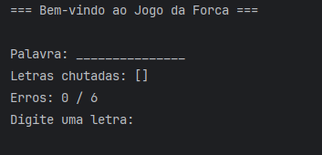
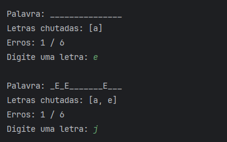
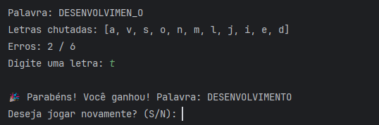

# 🎯 Jogo da Forca - Java 21


Jogo da Forca desenvolvido em Java que permite ao usuário adivinhar palavras, com limite de erros, letras chutadas e partidas múltiplas.

---

## Índice

- [Descrição do Projeto](#descrição-do-projeto)
- [Funcionalidades](#funcionalidades)
- [Tecnologias Utilizadas](#tecnologias-utilizadas)
- [Requisitos](#requisitos)
- [Como Rodar](#como-rodar)
- [Exemplos de Uso](#exemplos-de-uso)
- [Estrutura do Projeto](#estrutura-do-projeto)
- [Testes Unitários](#testes-unitários)


---

## Descrição do Projeto

O ForcaGame é um jogo de console em Java que demonstra conceitos de programação orientada a objetos (POO), como encapsulamento, classes, métodos e enums.

O jogo permite:
- Definir uma lista de palavras personalizadas.
- Chutar letras para descobrir a palavra oculta.
- Controlar o número máximo de erros (6 erros por partida).
- Mostrar letras chutadas, palavra mascarada e resultado final da partida.

O projeto também utiliza JUnit 5 para testes unitários, garantindo que a lógica do jogo funcione corretamente.

---

## Funcionalidades

- Iniciar novas partidas com palavras aleatórias.
- Chutar letras individualmente.
- Exibir palavra mascarada e letras chutadas.
- Controlar erros e estado do jogo (JOGANDO, GANHOU, PERDEU).
- Permitir jogar novamente após o término de uma partida.

---

## Tecnologias Utilizadas

- Java 21
- Maven
- JUnit 5 para testes unitários
- Lombok para geração automática de getters/setters e construtores
- Uso de enums para estados do jogo


---

## Requisitos

- JDK 21 
- Maven instalado
- IDE recomendada: IntelliJ IDEA (mas qualquer IDE Java serve)

---

## Como Rodar

1. Clone o repositório:
```bash
git clone https://github.com/leolsm12/JogoDaForca.git
```

2. Navegue até o diretório do projeto:
```bash 
cd JogoDaForca
```
3. Compile o projeto usando Maven:
```bash 
mvn clean compile exec:java -Dexec.mainClass="com.forca.Main"
```
4. Use o menu interativo no console para operar o sistema.

## Exemplos de Uso
### Início de Partida

O jogo começa exibindo a palavra mascarada e solicitando o chute:



### Chutar Letras
O usuário digita letras, e o jogo atualiza a palavra e os erros:




### Resultado
Ao final da partida, o jogo informa vitória ou derrota:




## Estrutura do Projeto

A estrutura do projeto é organizada da seguinte forma:

```
src/
├── main/
│   ├── java/com/forca/
│   │   ├── model/              # Classes de domínio (Palavra, Partida, EstadoJogo)
│   │   ├── service/            # responsável por gerenciar a lógica principal do jogo
│   │   ├── view/               # exibe o estado atual do jogo e interage com o usuário
│   │   └── Main.java           # Classe principal que inicializa o jogo
├── test/
│   └── java/
│       ├── PartidaTest.java      
│       └── JogoServiceTest.java
``` 


### Pré-requisitos para rodar os testes

- **Java 21** instalado e configurado no PATH.
- **Apache Maven** instalado ([Guia de instalação](https://maven.apache.org/install.html)).

Para verificar se está tudo instalado corretamente:

```bash
java -version
mvn -version
```

##  Testes Unitários

O projeto possui testes unitários cobrindo:

- Inicialização da partida.
- Processamento de chutes válidos e repetidos.
- Atualização da máscara da palavra.
- Verificação do estado do jogo (**JOGANDO**, **GANHOU**, **PERDEU**).

### Executando os testes

Na pasta raiz do projeto, execute:

```bash
mvn test